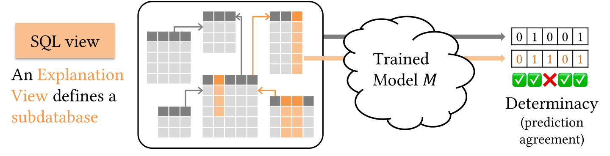

# RDLExplain

**Database Views as Explanations for Relational Deep Learning**
Agapi Rissaki, Ilias Fountalis, Wolfgang Gatterbauer, Benny Kimelfeld — PVLDB 19(7), 2026.
[Paper](https://doi.org/10.14778/3801059.3801075)



This library produces explanations of RDL models over a relational databases in the form of **database
views**, i.e., queries identifying the parts of the database the model actually relies on.

An explanation is good when it *soft-determines* the model: perturb everything the view
does not cover, and the predictions change only slightly. That quantity is **deviation from
determinacy (devΔ)**, and lower is better. It compares the model against itself, so no
ground-truth labels are needed.

Three explanation languages, learned by masking:

| Language | Question | Explanation |
|---|---|---|
| `Projection` | which **columns**? | `select key, A₁ … A_k from R` |
| `FKJoin` | which **joins**? | `select * from R, S where R.C = S.key` |
| `Selection` | which **rows**? | `select * from R where φ` |

## Install

```bash
conda env create -f environment.yml
conda activate relbench_v1
```

This installs the package in editable mode, so `import rdl_explain` works anywhere.

## Artifacts

The notebooks explain models that are **already trained**, distributed from
**[Google Drive](https://drive.google.com/drive/folders/13mYWpzK9ox2jhObKHaSpO6P8isn4ijcv?usp=sharing)**
as separate archives. Take only the ones you need:

| Archive | Size | Needed for |
|---|---|---|
| `rel-f1.tar.gz` | 7 MB | notebook 01 — driver-dnf, the paper's task D1T1 |
| `synthetic.tar.gz` | 1 MB | notebook 02 — the toy R-S-T database of Example 1, both tasks |
| `rel-trial-models.tar.gz` | 16 MB | notebook 03 — **always needed**, all four scenarios |
| `rel-trial-graph-base.tar.gz` | 5.5 GB | notebook 03 — the *Original* and *Structural* scenarios |
| `rel-trial-graph-leakage-column.tar.gz` | 5.5 GB | notebook 03 — the *Column leakage* scenario |
| `rel-trial-graph-leakage-tuple.tar.gz` | 5.5 GB | notebook 03 — the *Tuple leakage* scenario |

The first two are small and together cover notebooks 01 and 02. The rel-trial graphs are
large because 98% of each is dense text embeddings over 5.8M rows. They are split so you
can fetch each scenario's graph separately. *Original* and *Structural* share a
graph because the structural intervention rewrites task labels only, leaving the database
untouched.

Unpack into `artifacts/`, keeping each archive's internal paths:

```bash
mkdir -p artifacts
tar -xzf rel-f1.tar.gz -C artifacts        # -> artifacts/rel-f1/driver-dnf/
sha256sum -c SHA256SUMS                    # worth doing for the large ones
```

The notebooks find `artifacts/` by searching upward from the working directory, so no
configuration is needed; set `RDL_EXPLAIN_DATA` to keep it elsewhere. Google Drive shows an
interstitial for files over 100 MB, so plain `wget` fetches an HTML page instead of the
archive — use the web interface or [`gdown`](https://github.com/wkentaro/gdown).

Each bundle carries its graph, its weights, the predictions the model produced, and a
`manifest.json` recording the exact architecture. `load_bundle` **re-runs inference and
checks it reproduces those predictions** before returning. This matters: settings like the
message aggregation are not stored in the weights, so a wrong one loads without error and
yields a model that runs and is wrong.

The remaining data used in the paper's experiments is available upon request.

## Notebooks

| Notebook | What it does |
|---|---|
| [`01_explain_rel_f1`](notebooks/01_explain_rel_f1.ipynb) | **Start here.** Load a trained model, run `Projection` and `FKJoin`, measure devΔ. |
| [`02_case_study_synthetic`](notebooks/02_case_study_synthetic.ipynb) | A toy database where the label rule is known, so the recovered explanation can be checked. |
| [`03_case_study_clinical_trials`](notebooks/03_case_study_clinical_trials.ipynb) | The paper's case study: diagnosing planted data leakage on real clinical-trial data, using all three languages. |

## Training your own model

```bash
python scripts/train_gnn.py --dataset rel-f1 --task driver-dnf --config 3-hop
```

Presets are `2-hop`, `2-hop-large`, `3-hop`, `3-hop-large`; the `-large` variants sample
more neighbours per hop. The output is a bundle in the same layout, so the notebooks work
on it unchanged via `load_bundle("rel-f1/driver-dnf-3-hop")`.

## Repository layout

```
src/rdl_explain/
    explain/     explainer, devDelta evaluation, mask discretisation,
                 Selection predicates, visualisations
    model/       hetero-GNN (+ RelGT), with masked forward passes
    artifacts.py bundle loading and verification
    loaders.py   graph/model loading, checkpoint verification
scripts/         data generation, artifact staging, training
notebooks/       the three notebooks above
src/evaluation/  the paper's experiment harness (see below)
```

`src/evaluation/`, `src/learn_masks.py` and `src/learn_filter_masks.py` are the drivers
behind the paper's Figures 5 and 6, including the baselines. 

## Citation

```bibtex
@article{rissaki2026database,
  title   = {Database Views as Explanations for Relational Deep Learning},
  author  = {Rissaki, Agapi and Fountalis, Ilias and Gatterbauer, Wolfgang
             and Kimelfeld, Benny},
  journal = {Proceedings of the VLDB Endowment},
  volume  = {19}, number = {7}, pages = {1643--1658}, year = {2026},
  doi     = {10.14778/3801059.3801075}
}
```

## License

[![CC BY-NC 4.0][cc-by-nc-shield]][cc-by-nc]

This work is licensed under a
[Creative Commons Attribution-NonCommercial 4.0 International License][cc-by-nc].
Third-party code is attributed in [THIRD_PARTY_NOTICES.md](THIRD_PARTY_NOTICES.md).

[cc-by-nc]: https://creativecommons.org/licenses/by-nc/4.0/
[cc-by-nc-image]: https://licensebuttons.net/l/by-nc/4.0/88x31.png
[cc-by-nc-shield]: https://img.shields.io/badge/License-CC%20BY--NC%204.0-lightgrey.svg
